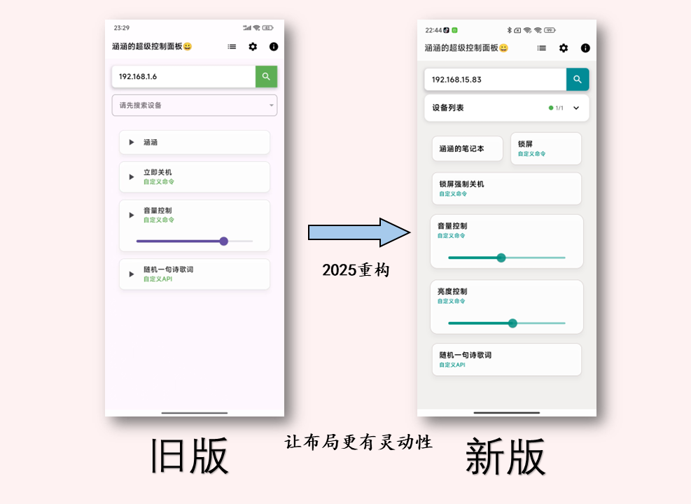
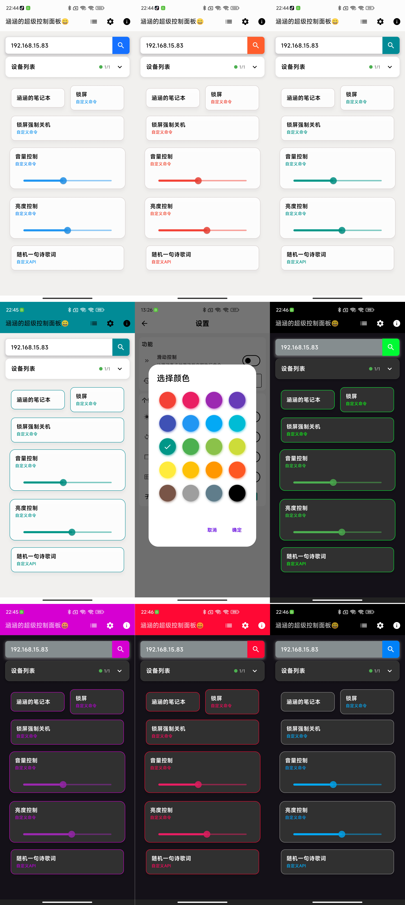
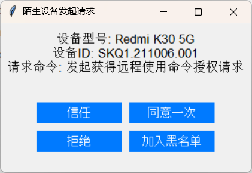

# 涵涵的超级控制面板
一个 **局域网的懒人快捷操控执行远程命令助手**    
设计的理由也很简单，"**懒😊**"  
由于移动端确实非常方便，简简单单的交互就可以了，所以因为 "**懒**" 诞生了此项目  
当前项目是 移动端   
**服务端：**  [涵涵的超级控制终端——服务端](https://github.com/lanzeweie/HanHan_terminal)    

## 使用截图   

2025重构命令布局

丰富的颜色

设备安全验证

## 功能
主要功能：根据服务端的配置信息，执行相应的指令  
新增：`设备列表` 可以保存曾经成功连接过的服务端。支持公网ip   
搜索设备依旧只能搜索局域网网段，可以手动输入公网ip、不在同一网段ip       
支持：GET 、POST 卡片请求。POST 可使用滑动条附带数值。  
支持查看 命令执行后的返回信息  
支持浅色模式、深色模式  

## 文件结构  
代码目录   
lib/      
├── Config/  
│   └── device_utils.dart           # 提供设备信息的函数    
│   ├── lib\Config\update.dart      # 提供更新的函数 
│   └── lib\Config\first_teaching.dart #新手教程
├── Function/                       # 可接入更多功能的文件夹  
│   ├── Function_DanZhu.dart        # 单个固定地址的功能实现   
│   ├── Function_GroupZhu.dart      # 群体请求功能实现  
│   └── Function_Id_page.dart       # 设备信息功能实现   
├── color.dart                      # 主题颜色（浅色模式与深色模式）   
├── Function.dart                   # 接入更多功能的库  
├── Introduction.dart               # 个人信息介绍页   
├── main.dart                       # 主程序入口，作用于头部   
├── ProviderHanAll.dart             # 异步数据流函数   
├── Setconfig.dart                  # 设置页面      
├── Startone.dart                   # 第一次启动展示页面       
└── zhu.dart                        # 主页面    

## 开发
Android Studio
Flutter 

## 打包
flutter build apk --split-per-abi --target=.\lib\main.dart

Android 启动页 尺寸
mdpi (1x)：320x480 pixels
hdpi (1.5x)：480x800 pixels
xhdpi (2x)：720x1280 pixels
xxhdpi (3x)：1080x1920 pixels
xxxhdpi (4x)：1440x2560 pixels